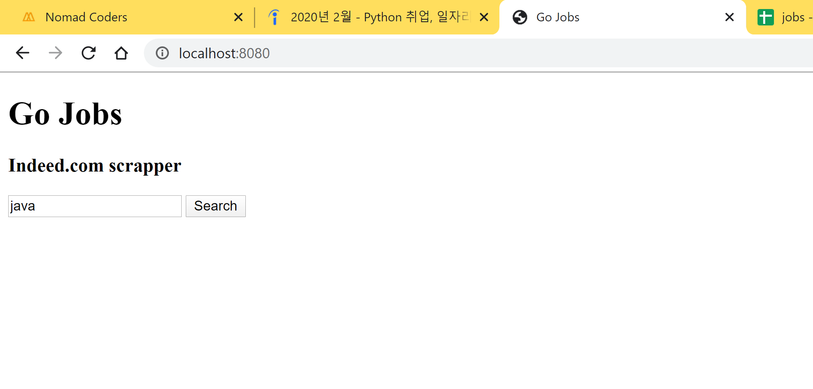

## Go is an amazing lauguage !!! 

### Local Host made with echo library

### Extracting jobs from the site

### Saving the csv file

### csv file open result

- This content is made following the Nomad coder academy's free tutorial
- Check out the tutorial on this site : [https://academy.nomadcoders.co](https://academy.nomadcoders.co)